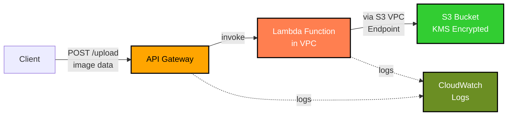

# AWS Picture Upload Service interview task @ Convertr

- Secure image upload via REST API using API Gateway
- Lambda in private VPC subnet
- S3 access via S3 VPC endpoint ONLY
- File type validation using magic byte detection (Supported formats: JPEG, PNG, GIF, WebP)
- KMS encryption at rest in the S3 bucket
- Automated CI/CD with GitHub Actions with OIDC auth to AWS

For detailed task definition, navigate to [DevOps Interview Task 2025.pdf](<./DevOps Interview Task 2025.pdf>)

## Architecture



## Project Structure

```
├── lambda/                # TypeScript Lambda function
│   └── src/
├── terraform/
│   ├── environments/dev/  # Environment config
│   └── modules/           # Reusable modules
│       ├── api-gateway/
│       ├── lambda/
│       ├── s3/
│       └── vpc/
└── .github/workflows/     # CI/CD pipeline
```

## CI/CD

The following tasks are automated using GitHub Actions:

- Lambda build using `bun`
- Terraform validation, linting, vulnerability checking (audit, tfsec)
- `terraform plan` on feature branches
- Easy-access plan output in Pull Request comments.
- `terraform apply` on `main`

**IMPORTANT**  
Configure the following environment variables in repository settings:

- `ROLE_ARN` - ARN of role to assume through OIDC
- `AWS_REGION` - Target AWS region for deployment

## Quick Start

### Prerequisites

- Bun 1.2.22+
- Terraform 1.13.3+
- Configured AWS credentials

### Build Lambda

The picture uploader Lambda function is written in TypeScript.  
The preferred bundler is [`bun`](https://github.com/oven-sh/bun)

```bash
cd lambda
bun install
bun run build
```

This will emit a single `index.mjs` file to the `lambda/dist` folder.  
Terraform automatically zip this file for Lambda deployment.

### Configure terraform

Update `terraform/environments/dev/backend.tf` with your S3 backend bucket.  
Configure project name, AWS region and environemnt name in `terraform/environments/dev/variables.tf`

### Deploy

```bash
cd terraform/environments/dev
terraform init
terraform plan
terraform apply
```

Set the API Endpoint in an environment variable for the next step:

```bash
API_ENDPOINT=$(terraform output -raw api_endpoint)
```

### Upload Image

Upload an image using `curl` as follows:

```bash
curl -X POST $API_ENDPOINT \
  -H "Content-Type: image/png" \
  --data-binary "@/path/to/image.png"
```

Please note that the images stored in S3 use pseudorandom names to avoid naming collisions.  
Therefore, the `Content-Disposition` (with `filename`) header is not defined.

### Cleanup

```bash
cd terraform/environments/dev
terraform destroy
```

## Response Examples

### Success

```json
{
  "message": "Picture uploaded successfully",
  "bucket": "convertr-interview-dev-abc123",
  "key": "uploads/e0357bde-4e69-45c8-9582-80b442b7502a.png",
  "size": 12345
}
```

### Error

```json
{
  "error": "Unsupported file type (magic bytes)"
}
```

# Improvements

The following optional improvements have been identified during the development, but skipped due to the limited time and scope of requirements:

- Use pre-signed S3 URLs for large files to exceed API gateway size limits and Lambda execution time limits.
- Configure CloudWatch alarms
- API Gateway throttling
- Use Lambda versions and aliases for easier release/rollback
- Configure Checkov for vulnerability scanning
